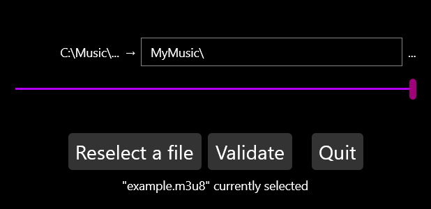
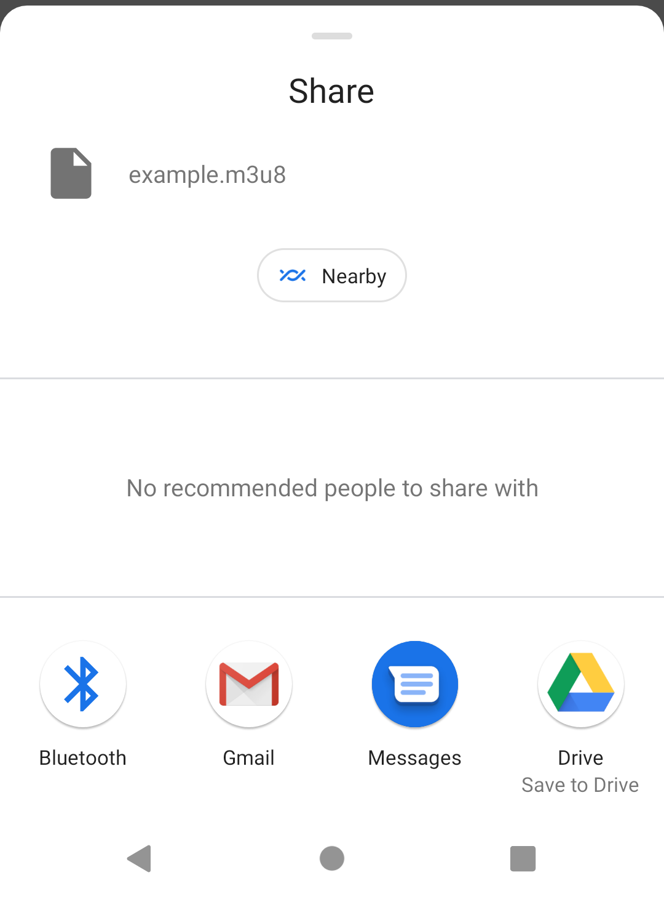

#	 m3u8 relativisator
Change all the paths in a m3u or m3u8 file to relative ones

##	Features
-	Detect and replace only the lines of text that are paths
-	Compatible with forward and backward slashes
-	Compatible with Windows drive letter and file URI prefix
-	Subfolders-compatible by replacing only the beginning of the path present in every paths
-	Remove the path folder by folder
-	Input a custom path
-	Keep the original file's line endings

##	How does it work
1.	**Select a m3u or m3u8 file**
2.	**Choose the folders to remove using the slider and/or input a custom path**
	
3.	**Validate to get the modified file**

##	Additional information
-	As explained in the current latest release, the Android version of m3u8 relativisator sends back the modified file with Android's sharing file UI

##	Missing features
-	The Android version of this app is currently missing a "Save As" dialog (Android has one natively but it can't be called within Xamarin as of writing this)
